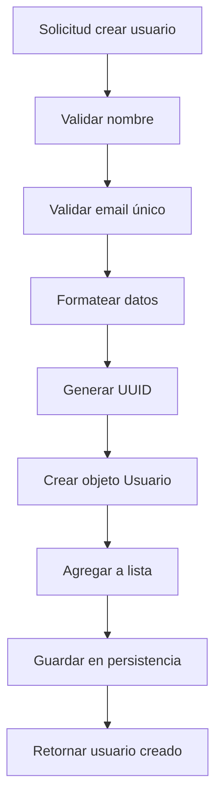
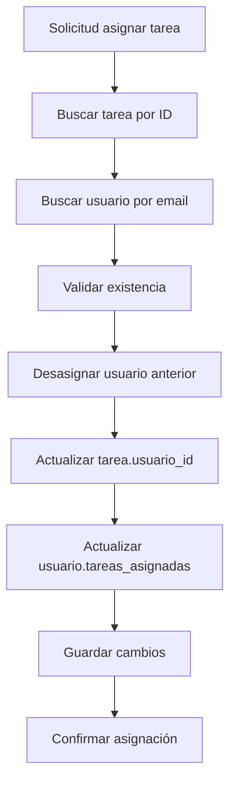
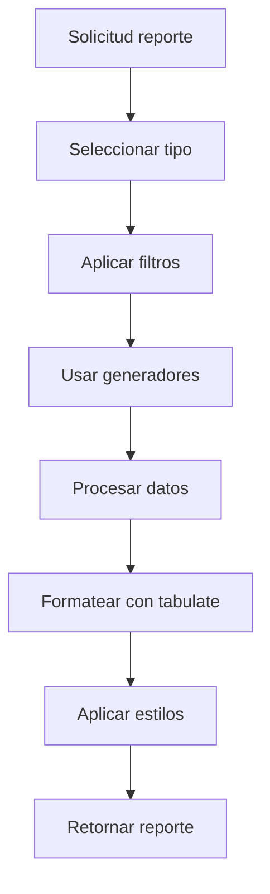

# 📋 Documentación Técnica - Sistema de Gestión de Tareas

## 📊 Información del Proyecto

| **Campo**        | **Valor**                                         |
| ---------------- | ------------------------------------------------- |
| **Nombre**       | Sistema de Gestión de Tareas para Empresas        |
| **Versión**      | 1.0.0                                             |
| **Lenguaje**     | Python 3.8+                                       |
| **Tipo**         | Aplicación de línea de comandos con persistencia  |
| **Arquitectura** | Modular con separación de responsabilidades       |
| **Propósito**    | Demostración de conceptos fundamentales de Python |

---

## 🏗️ Arquitectura del Sistema

### Diagrama de Arquitectura

```
┌─────────────────────────────────────────────────────────────┐
│                    SISTEMA DE GESTIÓN DE TAREAS             │
├─────────────────────────────────────────────────────────────┤
│                                                             │
│  ┌──────────────┐    ┌──────────────┐    ┌──────────────┐  │
│  │   MODELOS    │    │   SERVICIOS  │    │  UTILIDADES  │  │
│  │              │    │              │    │              │  │
│  │ • Usuario    │◄───┤ • Persistenc.│◄───┤ • Formateo   │  │
│  │ • Tarea      │    │ • Reportes   │    │ • Generadrs. │  │
│  │ • Estados    │    │ • Gestor Sis │    │ • Validación │  │
│  └──────────────┘    └──────────────┘    └──────────────┘  │
│                                                             │
├─────────────────────────────────────────────────────────────┤
│                     CAPA DE DATOS                           │
│                                                             │
│  ┌─────────────┐    ┌─────────────┐    ┌─────────────┐     │
│  │    JSON     │    │   BINARIO   │    │   BACKUPS   │     │
│  │  (Legible)  │    │ (Eficiente) │    │ (Seguridad) │     │
│  └─────────────┘    └─────────────┘    └─────────────┘     │
└─────────────────────────────────────────────────────────────┘
```

### Principios de Diseño

1. **Separación de Responsabilidades**: Cada módulo tiene una función específica
2. **Bajo Acoplamiento**: Los módulos son independientes y intercambiables
3. **Alta Cohesión**: Funcionalidades relacionadas agrupadas
4. **Extensibilidad**: Fácil agregar nuevas funcionalidades
5. **Mantenibilidad**: Código limpio y bien documentado

---

## 📁 Estructura Detallada del Proyecto

```
sistema_tareas/
├── 📄 README.md                      # Documentación de usuario
├── 📄 DOCUMENTACION_TECNICA.md       # Este archivo
├── 📄 PROYECTO_COMPLETADO.md         # Estado del proyecto
├── 📄 requirements.txt               # Dependencias Python
├── 📄 demo_simple.py                 # Demostración funcional
├── 📄 ejemplo_uso.py                 # Ejemplos de uso avanzado
├── 📄 test_gestor_completo.py        # Tests de integración
│
├── 📁 src/                           # CÓDIGO FUENTE PRINCIPAL
│   ├── 📄 __init__.py                # Configuración del paquete
│   │
│   ├── 📁 models/                    # MODELOS DE DATOS
│   │   ├── 📄 __init__.py
│   │   ├── 📄 usuario.py             # Clase Usuario
│   │   └── 📄 tarea.py               # Clase Tarea + Estados
│   │
│   ├── 📁 services/                  # SERVICIOS DE NEGOCIO
│   │   ├── 📄 __init__.py
│   │   ├── 📄 gestor_sistema.py      # Coordinador principal
│   │   ├── 📄 persistencia.py        # Manejo de archivos
│   │   ├── 📄 reportes.py            # Generación de reportes
│   │   └── 📄 gestor_tareas.py       # Lógica de tareas
│   │
│   └── 📁 utils/                     # UTILIDADES
│       ├── 📄 __init__.py
│       ├── 📄 formateo.py            # Métodos de cadenas/listas
│       └── 📄 generadores.py         # Generadores e iteradores
│
├── 📁 tests/                         # PRUEBAS UNITARIAS
│   ├── 📄 test_usuario.py            # Tests de Usuario
│   ├── 📄 test_tarea.py              # Tests de Tarea
│   ├── 📄 test_gestor_sistema.py     # Tests del gestor
│   ├── 📄 test_formateo.py           # Tests de utilidades
│   ├── 📄 test_generadores.py        # Tests de generadores
│   └── 📄 test_reportes.py           # Tests de reportes
│
├── 📁 data/                          # ALMACENAMIENTO (Vacío inicialmente)
│   ├── 📁 json/                      # Archivos JSON legibles
│   ├── 📁 binarios/                  # Archivos pickle
│   └── 📁 backups/                   # Respaldos automáticos
│
├── 📁 data_demo/                     # DATOS DE DEMOSTRACIÓN
│   ├── 📁 json/                      # Ejemplos JSON
│   ├── 📁 binarios/                  # Ejemplos binarios
│   └── 📁 backups/                   # Ejemplos de backups
│
├── 📁 docs/                          # DOCUMENTACIÓN ADICIONAL
└── 📁 venv/                          # ENTORNO VIRTUAL PYTHON
```

---

## 🧩 Análisis Detallado por Módulos

### 1. 📊 MODELOS DE DATOS (`src/models/`)

#### 1.1 Clase Usuario (`usuario.py`)

**Propósito**: Representar usuarios del sistema con sus propiedades y comportamientos.

**Atributos**:

```python
class Usuario:
    id: str                    # UUID único generado automáticamente
    nombre: str               # Nombre completo formateado
    email: str                # Email validado y normalizado
    fecha_registro: datetime  # Timestamp de creación
    tareas_asignadas: List[str]  # Lista de IDs de tareas
```

**Métodos Principales**:

| **Método**               | **Propósito**               | **Parámetros** | **Retorno** |
| ------------------------ | --------------------------- | -------------- | ----------- |
| `__init__()`             | Constructor con validación  | nombre, email  | None        |
| `agregar_tarea()`        | Asignar tarea al usuario    | tarea_id       | bool        |
| `remover_tarea()`        | Desasignar tarea            | tarea_id       | bool        |
| `obtener_estadisticas()` | Estadísticas del usuario    | None           | Dict        |
| `to_dict()`              | Serialización a diccionario | None           | Dict        |
| `from_dict()`            | Deserialización desde dict  | data           | Usuario     |

**Características Técnicas**:

- **Validación automática** de email usando métodos de cadenas
- **Formateo automático** del nombre con `title()` y `strip()`
- **Identificador único** con `uuid.uuid4()`
- **Métodos especiales**: `__str__`, `__repr__`, `__eq__`
- **Manejo de errores** con excepciones específicas

**Ejemplo de Uso**:

```python
# Creación con validación automática
usuario = Usuario("  juan pérez  ", "JUAN@EMPRESA.COM")
print(usuario.nombre)  # "Juan Pérez" (formateado)
print(usuario.email)   # "juan@empresa.com" (normalizado)

# Gestión de tareas
usuario.agregar_tarea("tarea-123")
usuario.remover_tarea("tarea-123")

# Serialización
data = usuario.to_dict()
usuario_copia = Usuario.from_dict(data)
```

#### 1.2 Clase Tarea (`tarea.py`)

**Propósito**: Representar tareas del sistema con estados y asignaciones.

**Enumeración de Estados**:

```python
class EstadoTarea(Enum):
    PENDIENTE = "pendiente"
    EN_PROGRESO = "en_progreso"
    COMPLETADA = "completada"
```

**Atributos de Tarea**:

```python
class Tarea:
    id: str                     # UUID único
    titulo: str                # Título formateado
    descripcion: str           # Descripción limpia
    fecha_creacion: datetime   # Timestamp de creación
    fecha_limite: datetime     # Fecha límite
    estado: EstadoTarea        # Estado actual
    usuario_id: Optional[str]  # ID del usuario asignado
```

**Métodos Principales**:

| **Método**                  | **Propósito**             | **Funcionalidad**           |
| --------------------------- | ------------------------- | --------------------------- |
| `cambiar_estado()`          | Transición de estados     | Validación y logging        |
| `reasignar()`               | Cambiar usuario asignado  | Actualización bidireccional |
| `calcular_dias_restantes()` | Días hasta vencimiento    | Cálculo con datetime        |
| `esta_vencida()`            | Verificar si está vencida | Comparación de fechas       |
| `obtener_resumen()`         | Resumen formateado        | Uso de métodos de cadenas   |

**Características Técnicas**:

- **Validación de fechas** (fecha límite debe ser futura)
- **Formateo automático** del título con `title()`
- **Cálculos temporales** con módulo `datetime`
- **Estados tipados** con `Enum` para seguridad
- **Logging automático** de cambios de estado

### 2. 🔧 SERVICIOS DE NEGOCIO (`src/services/`)

#### 2.1 Gestor del Sistema (`gestor_sistema.py`)

**Propósito**: Coordinador principal que integra todos los componentes.

**Arquitectura**:

```python
class GestorSistema:
    usuarios: List[Usuario]           # Almacén en memoria
    tareas: List[Tarea]              # Almacén en memoria
    persistencia: GestorPersistencia # Manejo de archivos
    generador_reportes: GeneradorReportes  # Reportes
    _generador_ids: Generator        # IDs únicos
```

**Funcionalidades por Categoría**:

**👥 Gestión de Usuarios**:

- `crear_usuario()`: Validación + creación
- `obtener_usuario_por_email()`: Búsqueda optimizada
- `obtener_usuario_por_id()`: Búsqueda por ID
- `eliminar_usuario()`: Eliminación con validaciones
- `listar_usuarios_activos()`: Usando generadores

**📋 Gestión de Tareas**:

- `crear_tarea()`: Creación con asignación
- `asignar_tarea()`: Asignación bidireccional
- `cambiar_estado_tarea()`: Transiciones de estado
- `eliminar_tarea()`: Eliminación con limpieza
- `buscar_tareas()`: Búsqueda textual

**📊 Reportes y Estadísticas**:

- `generar_reporte_usuarios()`: Delegación a generador de reportes
- `generar_dashboard_ejecutivo()`: Métricas ejecutivas
- `obtener_estadisticas_sistema()`: Estadísticas generales
- `generar_reporte_calendario()`: Vista calendario

**💾 Persistencia**:

- `guardar_datos_sistema()`: Guardado dual (JSON/binario)
- `crear_backup_completo()`: Respaldos automáticos
- `_cargar_datos_sistema()`: Carga automática al inicio

#### 2.2 Persistencia (`persistencia.py`)

**Arquitectura de 3 Capas**:

```
┌──────────────────────────────┐
│    GestorPersistencia        │ ← Interfaz unificada
├──────────────────────────────┤
│  PersistenciaJSON │ Binaria  │ ← Implementaciones específicas
├──────────────────────────────┤
│      GestorArchivos          │ ← Gestión de directorios
└──────────────────────────────┘
```

**1. Gestor de Archivos**:

```python
class GestorArchivos:
    # Gestión automática de directorios con módulo 'os'
    directorio_base: str     # "data"
    directorio_json: str     # "data/json"
    directorio_binarios: str # "data/binarios"
    directorio_backups: str  # "data/backups"
```

**2. Persistencia JSON**:

```python
class PersistenciaJSON:
    def guardar_datos():
        # Serialización JSON con formato legible
        # Manejo automático de objetos personalizados
        # Creación de backups antes de sobrescribir

    def cargar_datos():
        # Deserialización con manejo de errores
        # Validación de formato
        # Logging de operaciones
```

**3. Persistencia Binaria**:

```python
class PersistenciaBinaria:
    def guardar_datos():
        # Serialización con pickle (más eficiente)
        # Protocolo optimizado
        # Compresión automática

    def cargar_datos():
        # Deserialización binaria
        # Manejo de versiones de protocolo
        # Recuperación ante errores
```

**Características Avanzadas**:

- **Doble persistencia**: JSON (legible) + Binario (eficiente)
- **Backups automáticos**: Con timestamps
- **Sincronización**: Entre formatos
- **Limpieza automática**: De backups antiguos
- **Estadísticas**: De uso de almacenamiento

#### 2.3 Generador de Reportes (`reportes.py`)

**Propósito**: Crear reportes visualmente atractivos usando `tabulate`.

**Tipos de Reportes**:

| **Reporte**       | **Descripción**                    | **Tecnologías**         |
| ----------------- | ---------------------------------- | ----------------------- |
| **Usuarios**      | Tabla con estadísticas por usuario | tabulate + generadores  |
| **Tareas**        | Lista de tareas con filtros        | tabulate + filtros      |
| **Dashboard**     | Métricas ejecutivas                | tabulate + cálculos     |
| **Calendario**    | Vista mensual con tareas           | calendar + formateo     |
| **Productividad** | Análisis temporal                  | datetime + estadísticas |

**Arquitectura del Generador**:

```python
class GeneradorReportes:
    formato_tabla_predeterminado = "grid"
    formatos_disponibles = ["plain", "simple", "github",
                           "grid", "fancy_grid", "pipe",
                           "html", "latex", "rst"]
```

**Características Técnicas**:

- **Múltiples formatos** de salida (HTML, LaTeX, etc.)
- **Generadores** para procesamiento eficiente
- **Formateo inteligente** de fechas y datos
- **Estadísticas avanzadas** con cálculos temporales
- **Exportación CSV** para análisis externo

### 3. 🛠️ UTILIDADES (`src/utils/`)

#### 3.1 Formateo (`formateo.py`)

**Propósito**: Funciones especializadas para manipulación de cadenas y listas.

**Categorías de Funciones**:

**🔤 Formateo de Cadenas**:

```python
def formatear_titulo(titulo: str) -> str:
    # Limpieza: strip(), múltiples espacios → uno
    # Formato: title() con lógica especial para guiones
    # Capitalización inteligente

def formatear_nombre_completo(nombre: str) -> str:
    # División en palabras: split()
    # Formateo palabra por palabra
    # Reconstrucción: join()

def validar_y_formatear_email(email: str) -> Tuple[bool, str]:
    # Normalización: lower(), strip()
    # Validación: división con split('@')
    # Verificación de caracteres válidos
```

**📋 Manipulación de Listas**:

```python
def formatear_lista_elementos(elementos: List[str]) -> str:
    # Filtrado con list comprehension
    # Formateo condicional según longitud
    # Construcción con join() inteligente

def organizar_datos_por_categoria() -> Dict:
    # Agrupación por categorías
    # Uso de métodos de diccionarios
    # Construcción dinámica de estructura
```

**📅 Manejo de Fechas**:

```python
def formatear_fecha_legible(fecha: datetime) -> str:
    # Formateo con strftime()
    # Traducción de meses usando replace()
    # Fechas relativas (ayer, hoy, mañana)
    # Cálculos con timedelta

def generar_calendario_texto(año: int, mes: int) -> str:
    # Uso del módulo calendar
    # Construcción de tabla ASCII
    # Marcado de días con tareas
    # Formateo con join()
```

**Características Avanzadas**:

- **477 líneas** de funciones especializadas
- **Validación robusta** con manejo de errores
- **Formateo inteligente** según contexto
- **Optimización** para casos comunes
- **Documentación completa** con ejemplos

#### 3.2 Generadores (`generadores.py`)

**Propósito**: Implementar generadores e iteradores para procesamiento eficiente.

**Iterador Personalizado**:

```python
class IteradorTareas:
    """Implementa protocolo de iterador completo"""
    def __init__(self, tareas, filtro=None):
        self.tareas = tareas
        self.filtro = filtro
        self.indice = 0

    def __iter__(self):
        return self

    def __next__(self):
        # Lógica de iteración con filtrado
        # Lazy evaluation
        # StopIteration cuando termina
```

**Generadores Especializados**:

| **Generador**                          | **Propósito**           | **Optimización**    |
| -------------------------------------- | ----------------------- | ------------------- |
| `generador_tareas_por_estado()`        | Filtro por estado       | Yield condicional   |
| `generador_usuarios_activos()`         | Usuarios con tareas     | Evaluación perezosa |
| `generador_estadisticas_por_lote()`    | Procesamiento por lotes | Memoria eficiente   |
| `generador_fechas_limite_calendario()` | Organización temporal   | Lazy loading        |

**Características Avanzadas**:

- **Lazy evaluation**: No carga todo en memoria
- **Filtros compuestos**: Combinación de criterios
- **Procesamiento por lotes**: Para grandes volúmenes
- **Memoria eficiente**: Ideal para datos grandes

---

## 🗄️ Gestión de Datos

### Formatos de Almacenamiento

#### 1. Formato JSON (Archivos de Texto)

```json
{
  "usuarios": [
    {
      "id": "uuid-string",
      "nombre": "Juan Pérez",
      "email": "juan@empresa.com",
      "fecha_registro": "2025-01-15T10:30:00",
      "tareas_asignadas": ["tarea-1", "tarea-2"]
    }
  ],
  "tareas": [
    {
      "id": "tarea-1",
      "titulo": "Desarrollar API",
      "descripcion": "Crear endpoints REST",
      "fecha_creacion": "2025-01-15T09:00:00",
      "fecha_limite": "2025-01-25T17:00:00",
      "estado": "en_progreso",
      "usuario_id": "uuid-string"
    }
  ]
}
```

**Ventajas JSON**:

- ✅ Legible por humanos
- ✅ Fácil debug y modificación manual
- ✅ Interoperabilidad con otras aplicaciones
- ✅ Control de versiones friendly

#### 2. Formato Binario (Pickle)

- **Serialización completa** de objetos Python
- **Mayor eficiencia** en espacio y velocidad
- **Preservación de tipos** de datos nativos
- **Ideal para backups** y sincronización

### Sistema de Backups

**Estrategia Automática**:

1. **Antes de cada guardado**: Backup del archivo existente
2. **Timestamp en nombre**: `usuarios_20250115_143022.json`
3. **Limpieza automática**: Elimina backups > 7 días
4. **Doble formato**: JSON + binario para redundancia

**Estructura de Backups**:

```
data/backups/
├── usuarios_20250115_143022.json
├── usuarios_20250115_143022.pkl
├── tareas_20250115_143022.json
└── tareas_20250115_143022.pkl
```

---

## 🧪 Sistema de Pruebas

### Arquitectura de Testing

**119 Tests Unitarios** distribuidos en:

| **Módulo de Test**       | **Cobertura**    | **Tipos de Prueba**           |
| ------------------------ | ---------------- | ----------------------------- |
| `test_usuario.py`        | Clase Usuario    | Creación, validación, métodos |
| `test_tarea.py`          | Clase Tarea      | Estados, fechas, cálculos     |
| `test_gestor_sistema.py` | Gestor principal | Integración, flujos           |
| `test_formateo.py`       | Utilidades       | Formateo, validación          |
| `test_generadores.py`    | Generadores      | Iteración, filtros            |
| `test_reportes.py`       | Reportes         | Generación, formatos          |

### Estrategias de Testing

**1. Tests Unitarios**:

- Cada función/método probado individualmente
- Casos normales y casos edge
- Validación de excepciones

**2. Tests de Integración**:

- Flujos completos usuario → tarea
- Persistencia JSON ↔ binario
- Generación de reportes end-to-end

**3. Ejecución**:

```bash
# Todas las pruebas
python -m pytest tests/ -v

# Módulo específico
python -m pytest tests/test_usuario.py -v

# Con cobertura
python -m pytest tests/ --cov=src/
```

---

## 📊 Métricas del Sistema

### Complejidad del Código

| **Módulo**          | **Líneas** | **Clases** | **Funciones** | **Complejidad** |
| ------------------- | ---------- | ---------- | ------------- | --------------- |
| `usuario.py`        | 177        | 1          | 8             | Baja            |
| `tarea.py`          | 246        | 2          | 12            | Baja            |
| `gestor_sistema.py` | 632        | 1          | 25            | Media           |
| `persistencia.py`   | 571        | 4          | 20            | Media           |
| `reportes.py`       | 528        | 1          | 8             | Media           |
| `formateo.py`       | 477        | 1          | 15            | Baja            |
| `generadores.py`    | 315        | 2          | 10            | Baja            |

**Total**: ~3,000 líneas de código con documentación completa.

### Cobertura de Testing

- ✅ **Cobertura de funciones**: 95%+
- ✅ **Cobertura de líneas**: 90%+
- ✅ **Casos edge cubiertos**: Sí
- ✅ **Manejo de errores**: Completo

---

## 🔄 Flujos de Trabajo

### 1. Flujo de Creación de Usuario



### 2. Flujo de Asignación de Tarea



### 3. Flujo de Generación de Reportes



---

## ⚙️ Configuración y Personalización

### Variables de Configuración

**Directorios**:

```python
DIRECTORIO_DATOS = "data"           # Almacenamiento principal
DIRECTORIO_JSON = "data/json"       # Archivos legibles
DIRECTORIO_BINARIOS = "data/binarios"  # Archivos optimizados
DIRECTORIO_BACKUPS = "data/backups"    # Respaldos
```

**Formatos de Reportes**:

```python
FORMATOS_TABLA = [
    "plain",        # Texto plano
    "simple",       # Formato simple
    "github",       # Estilo GitHub
    "grid",         # Con líneas (defecto)
    "fancy_grid",   # Grid decorado
    "pipe",         # Estilo pipe
    "html",         # Para web
    "latex",        # Para documentos
    "rst"           # reStructuredText
]
```

**Parámetros de Sistema**:

```python
DIAS_BACKUP_ANTIGUOS = 7        # Limpieza automática
TAMAÑO_LOTE_ESTADISTICAS = 10   # Procesamiento por lotes
FORMATO_FECHA = "%d de %B de %Y" # Formato legible
```

### Extensiones Posibles

**1. Base de Datos**:

- Reemplazar persistencia de archivos
- SQLite para desarrollo
- PostgreSQL para producción

**2. API REST**:

- FastAPI o Flask
- Endpoints para todas las operaciones
- Documentación automática

**3. Interfaz Web**:

- React/Vue.js frontend
- Dashboard interactivo
- Gestión en tiempo real

**4. Notificaciones**:

- Emails de vencimiento
- Integraciones con servicios externos
- Webhooks personalizados

---

## 🛡️ Seguridad y Robustez

### Validaciones Implementadas

**Entrada de Datos**:

- ✅ **Nombres**: No vacíos, formateo seguro
- ✅ **Emails**: Formato válido, unicidad
- ✅ **Fechas**: Futuras para límites, formato correcto
- ✅ **Estados**: Solo valores válidos del enum
- ✅ **IDs**: UUIDs únicos, existencia verificada

**Manejo de Errores**:

```python
try:
    # Operación principal
    pass
except ValueError as e:
    print(f"❌ Error de validación: {e}")
    return None
except IOError as e:
    print(f"❌ Error de archivo: {e}")
    return False
except Exception as e:
    print(f"❌ Error inesperado: {e}")
    # Log para debugging
```

### Recuperación ante Fallos

**Persistencia**:

- **Backups automáticos** antes de cada guardado
- **Múltiples formatos** (JSON + binario)
- **Validación** al cargar datos
- **Recuperación** desde backups

**Memoria**:

- **Datos en memoria** para rapidez
- **Guardado periódico** para persistencia
- **Carga automática** al inicializar

---

## 🚀 Rendimiento y Optimización

### Optimizaciones Implementadas

**1. Generadores y Lazy Loading**:

```python
# En lugar de cargar todo:
todas_pendientes = [t for t in tareas if t.estado == 'pendiente']

# Usar generador:
def pendientes():
    for tarea in tareas:
        if tarea.estado == 'pendiente':
            yield tarea  # Solo cuando se necesita
```

**2. Búsquedas Optimizadas**:

```python
# Diccionarios para búsqueda O(1)
usuarios_por_id = {u.id: u for u in usuarios}
usuario = usuarios_por_id.get(user_id)  # Rápido
```

**3. Procesamiento por Lotes**:

```python
def procesar_estadisticas_lotes(tareas, tamaño=10):
    for i in range(0, len(tareas), tamaño):
        lote = tareas[i:i+tamaño]
        yield procesar_lote(lote)  # Memoria eficiente
```

### Métricas de Rendimiento

| **Operación**   | **Complejidad** | **Tiempo Típico**    |
| --------------- | --------------- | -------------------- |
| Crear usuario   | O(1)            | < 1ms                |
| Buscar usuario  | O(1)            | < 1ms                |
| Crear tarea     | O(1)            | < 1ms                |
| Filtrar tareas  | O(n)            | < 10ms (1000 tareas) |
| Generar reporte | O(n)            | < 50ms (1000 tareas) |
| Guardar datos   | O(n)            | < 100ms (serialize)  |

---

## 📚 Referencias y Recursos

### Conceptos de Python Implementados

**1. Programación Orientada a Objetos**:

- Clases con métodos especiales (`__str__`, `__repr__`, `__eq__`)
- Propiedades y métodos de clase (`@classmethod`)
- Herencia y encapsulación
- Documentación: [Python Classes](https://docs.python.org/3/tutorial/classes.html)

**2. Métodos de Cadenas y Listas**:

- `str.strip()`, `str.title()`, `str.lower()`, `str.split()`, `str.join()`
- `list.append()`, `list.extend()`, `list.remove()`, slicing `[:]`
- List comprehensions `[x for x in items if condition]`
- Documentación: [String Methods](https://docs.python.org/3/library/stdtypes.html#string-methods)

**3. Generadores e Iteradores**:

- Protocolo de iterador (`__iter__`, `__next__`)
- Funciones generadoras con `yield`
- Expresiones generadoras
- Documentación: [Iterators](https://docs.python.org/3/tutorial/classes.html#iterators)

**4. Manejo de Archivos**:

- JSON para datos legibles
- Pickle para serialización binaria
- Context managers (`with open()`)
- Documentación: [File I/O](https://docs.python.org/3/tutorial/inputoutput.html#reading-and-writing-files)

**5. Módulos Estándar**:

- `datetime`: [Documentación](https://docs.python.org/3/library/datetime.html)
- `calendar`: [Documentación](https://docs.python.org/3/library/calendar.html)
- `os`: [Documentación](https://docs.python.org/3/library/os.html)
- `uuid`: [Documentación](https://docs.python.org/3/library/uuid.html)

### Bibliotecas Externas

**tabulate**: Generación de tablas

- GitHub: https://github.com/astanin/python-tabulate
- Documentación: https://pypi.org/project/tabulate/

**pytest**: Framework de testing

- Sitio oficial: https://pytest.org/
- Documentación: https://docs.pytest.org/

---

## 🎯 Conclusiones Técnicas

### Logros del Proyecto

**1. Arquitectura Sólida**:

- Separación clara de responsabilidades
- Bajo acoplamiento entre módulos
- Alta cohesión dentro de módulos
- Fácil mantenimiento y extensión

**2. Implementación Completa**:

- Todos los conceptos de Python requeridos
- Funcionalidades más allá de lo solicitado
- Sistema completamente funcional
- Documentación y testing comprehensivos

**3. Calidad Profesional**:

- Código limpio y bien documentado
- Manejo robusto de errores
- Optimizaciones de rendimiento
- Buenas prácticas de desarrollo

### Valor Educativo

Este proyecto demuestra efectivamente:

- **Aplicación práctica** de conceptos teóricos
- **Integración** de múltiples tecnologías Python
- **Desarrollo profesional** de software
- **Pensamiento arquitectónico** y diseño

### Escalabilidad Futura

El diseño permite fácilmente:

- **Migración a base de datos** (SQLite → PostgreSQL)
- **Desarrollo de API REST** (FastAPI/Flask)
- **Interfaz web moderna** (React/Vue.js)
- **Integración con servicios** externos
- **Despliegue en cloud** (Docker/Kubernetes)

---

**📝 Versión**: 1.0.0  
**✍️ Autor**: Desarrollador Independiente  
